mall项目全套学习教程连载中，[关注公众号](#公众号)第一时间获取。

# Elasticsearch快速入门，掌握这些刚刚好！

> 记得刚接触Elasticsearch的时候，没找啥资料，直接看了遍Elasticsearch的中文官方文档，中文文档很久没更新了，一直都是2.3的版本。最近又重新看了遍6.0的官方文档，由于官方文档介绍的内容比较多，每次看都很费力，所以这次整理了其中最常用部分，写下了这篇入门教程，希望对大家有所帮助。

## 简介

Elasticsearch是一个基于Lucene的搜索服务器。它提供了一个分布式的全文搜索引擎，基于restful web接口。Elasticsearch是用Java语言开发的，基于Apache协议的开源项目，是目前最受欢迎的企业搜索引擎。Elasticsearch广泛运用于云计算中，能够达到实时搜索，具有稳定，可靠，快速的特点。

## 安装

### Windows下的安装

#### Elasticsearch

- 下载Elasticsearch 6.2.2的zip包，并解压到指定目录，下载地址：https://www.elastic.co/cn/downloads/past-releases/elasticsearch-6-2-2

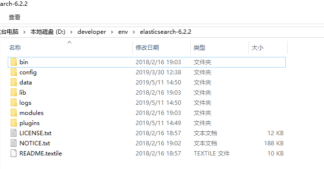

- 安装中文分词插件，在elasticsearch-6.2.2\bin目录下执行以下命令；

```bash
elasticsearch-plugin install https://github.com/medcl/elasticsearch-analysis-ik/releases/download/v6.2.2/elasticsearch-analysis-ik-6.2.2.zip
```


- 运行bin目录下的elasticsearch.bat启动Elasticsearch；

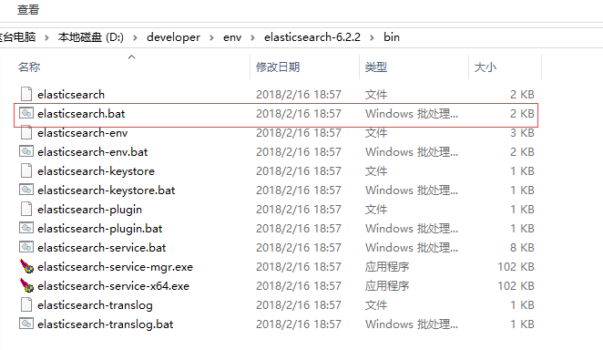

#### Kibana

- 下载Kibana,作为访问Elasticsearch的客户端，请下载6.2.2版本的zip包，并解压到指定目录，下载地址：https://artifacts.elastic.co/downloads/kibana/kibana-6.2.2-windows-x86_64.zip

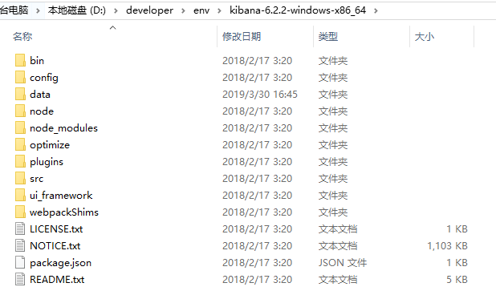

- 运行bin目录下的kibana.bat，启动Kibana的用户界面


- 访问[http://localhost:5601](http://localhost:5601) 即可打开Kibana的用户界面：

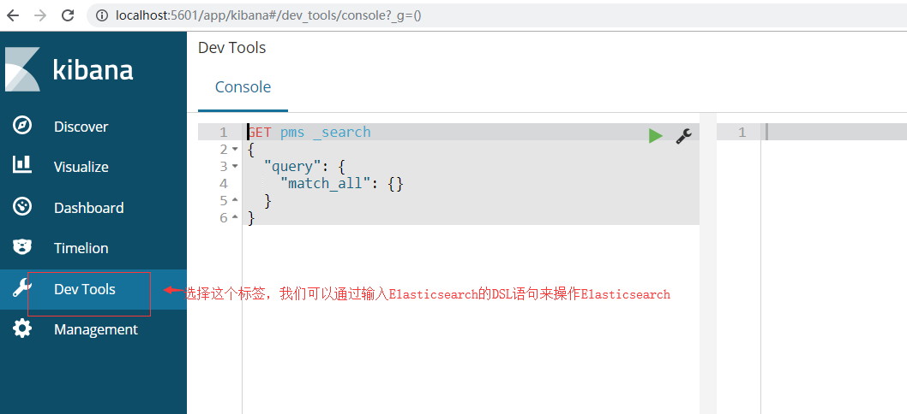

### Linux下的安装

#### Elasticsearch

- 下载elasticsearch 6.4.0的docker镜像；

```bash
docker pull elasticsearch:6.4.0
```

- 修改虚拟内存区域大小，否则会因为过小而无法启动；

```bash
sysctl -w vm.max_map_count=262144
```

- 使用docker命令启动；
```bash
docker run -p 9200:9200 -p 9300:9300 --name elasticsearch \
-e "discovery.type=single-node" \
-e "cluster.name=elasticsearch" \
-v /mydata/elasticsearch/plugins:/usr/share/elasticsearch/plugins \
-v /mydata/elasticsearch/data:/usr/share/elasticsearch/data \
-d elasticsearch:6.4.0
```
- 启动时会发现`/usr/share/elasticsearch/data`目录没有访问权限，只需要修改该目录的权限，再重新启动即可；

```bash
chmod 777 /mydata/elasticsearch/data/
```

- 安装中文分词器IKAnalyzer，并重新启动；

```bash
docker exec -it elasticsearch /bin/bash
#此命令需要在容器中运行
elasticsearch-plugin install https://github.com/medcl/elasticsearch-analysis-ik/releases/download/v6.4.0/elasticsearch-analysis-ik-6.4.0.zip
docker restart elasticsearch
```

- 访问会返回版本信息：[http://192.168.3.101:9200/](http://192.168.3.101:9200/)

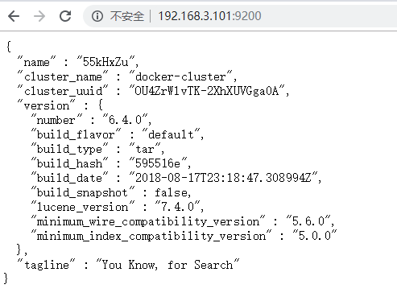

#### Kibina

- 下载kibana 6.4.0的docker镜像；

```bash
docker pull kibana:6.4.0
```

- 使用docker命令启动；

```bash
docker run --name kibana -p 5601:5601 \
--link elasticsearch:es \
-e "elasticsearch.hosts=http://es:9200" \
-d kibana:6.4.0
```

- 访问地址进行测试：[http://192.168.3.101:5601](http://192.168.3.101:5601)

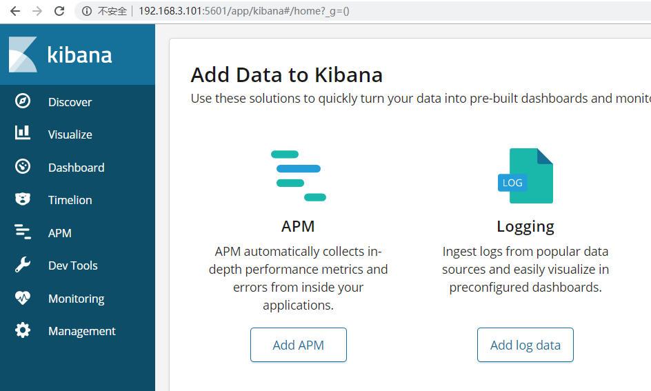

## 相关概念

- Near Realtime（近实时）：Elasticsearch是一个近乎实时的搜索平台，这意味着从索引文档到可搜索文档之间只有一个轻微的延迟(通常是一秒钟)。
- Cluster（集群）：群集是一个或多个节点的集合，它们一起保存整个数据，并提供跨所有节点的联合索引和搜索功能。每个群集都有自己的唯一群集名称，节点通过名称加入群集。
- Node（节点）：节点是指属于集群的单个Elasticsearch实例，存储数据并参与集群的索引和搜索功能。可以将节点配置为按集群名称加入特定集群，默认情况下，每个节点都设置为加入一个名为`elasticsearch`的群集。
- Index（索引）：索引是一些具有相似特征的文档集合，类似于MySql中数据库的概念。
- Type（类型）：类型是索引的逻辑类别分区，通常，为具有一组公共字段的文档类型，类似MySql中表的概念。`注意`：在Elasticsearch 6.0.0及更高的版本中，一个索引只能包含一个类型。
- Document（文档）：文档是可被索引的基本信息单位，以JSON形式表示，类似于MySql中行记录的概念。
- Shards（分片）：当索引存储大量数据时，可能会超出单个节点的硬件限制，为了解决这个问题，Elasticsearch提供了将索引细分为分片的概念。分片机制赋予了索引水平扩容的能力、并允许跨分片分发和并行化操作，从而提高性能和吞吐量。
- Replicas（副本）：在可能出现故障的网络环境中，需要有一个故障切换机制，Elasticsearch提供了将索引的分片复制为一个或多个副本的功能，副本在某些节点失效的情况下提供高可用性。

## 集群状态查看

- 查看集群健康状态；

```bash
GET /_cat/health?v
```

```bash
epoch      timestamp cluster       status node.total node.data shards pri relo init unassign pending_tasks max_task_wait_time active_shards_percent
1585552862 15:21:02  elasticsearch yellow          1         1     27  27    0    0       25             0                  -                 51.9%
```

- 查看节点状态；

```bash
GET /_cat/nodes?v
```

```bash
ip        heap.percent ram.percent cpu load_1m load_5m load_15m node.role master name
127.0.0.1           23          94  28                          mdi       *      KFFjkpV
```

- 查看所有索引信息；

```bash
GET /_cat/indices?v
```

```bash
health status index    uuid                   pri rep docs.count docs.deleted store.size pri.store.size
green  open   pms      xlU0BjEoTrujDgeL6ENMPw   1   0         41            0     30.5kb         30.5kb
green  open   .kibana  ljKQtJdwT9CnLrxbujdfWg   1   0          2            1     10.7kb         10.7kb
```

## 索引操作

- 创建索引并查看；

```bash
PUT /customer
GET /_cat/indices?v
```

```bash
health status index    uuid                   pri rep docs.count docs.deleted store.size pri.store.size
yellow open   customer 9uPjf94gSq-SJS6eOuJrHQ   5   1          0            0       460b           460b
green  open   pms      xlU0BjEoTrujDgeL6ENMPw   1   0         41            0     30.5kb         30.5kb
green  open   .kibana  ljKQtJdwT9CnLrxbujdfWg   1   0          2            1     10.7kb         10.7kb
```

- 删除索引并查看；

```bash
DELETE /customer
GET /_cat/indices?v
```

```bash
health status index    uuid                   pri rep docs.count docs.deleted store.size pri.store.size
green  open   pms      xlU0BjEoTrujDgeL6ENMPw   1   0         41            0     30.5kb         30.5kb
green  open   .kibana  ljKQtJdwT9CnLrxbujdfWg   1   0          2            1     10.7kb         10.7kb
```

## 类型操作

- 查看文档的类型；

```
GET /bank/account/_mapping
```

```json
{
  "bank": {
    "mappings": {
      "account": {
        "properties": {
          "account_number": {
            "type": "long"
          },
          "address": {
            "type": "text",
            "fields": {
              "keyword": {
                "type": "keyword",
                "ignore_above": 256
              }
            }
          },
          "age": {
            "type": "long"
          },
          "balance": {
            "type": "long"
          },
          "city": {
            "type": "text",
            "fields": {
              "keyword": {
                "type": "keyword",
                "ignore_above": 256
              }
            }
          },
          "email": {
            "type": "text",
            "fields": {
              "keyword": {
                "type": "keyword",
                "ignore_above": 256
              }
            }
          },
          "employer": {
            "type": "text",
            "fields": {
              "keyword": {
                "type": "keyword",
                "ignore_above": 256
              }
            }
          },
          "firstname": {
            "type": "text",
            "fields": {
              "keyword": {
                "type": "keyword",
                "ignore_above": 256
              }
            }
          },
          "gender": {
            "type": "text",
            "fields": {
              "keyword": {
                "type": "keyword",
                "ignore_above": 256
              }
            }
          },
          "lastname": {
            "type": "text",
            "fields": {
              "keyword": {
                "type": "keyword",
                "ignore_above": 256
              }
            }
          },
          "state": {
            "type": "text",
            "fields": {
              "keyword": {
                "type": "keyword",
                "ignore_above": 256
              }
            }
          }
        }
      }
    }
  }
}
```

## 文档操作

- 在索引中添加文档；

```
PUT /customer/doc/1
{
  "name": "John Doe"
}
```

```json
{
  "_index": "customer",
  "_type": "doc",
  "_id": "1",
  "_version": 1,
  "result": "created",
  "_shards": {
    "total": 2,
    "successful": 1,
    "failed": 0
  },
  "_seq_no": 3,
  "_primary_term": 1
}
```

- 查看索引中的文档；

```
GET /customer/doc/1
```

```json
{
  "_index": "customer",
  "_type": "doc",
  "_id": "1",
  "_version": 2,
  "found": true,
  "_source": {
    "name": "John Doe"
  }
}
```

- 修改索引中的文档：

```
POST /customer/doc/1/_update
{
  "doc": { "name": "Jane Doe" }
}
```

```json
{
  "_index": "customer",
  "_type": "doc",
  "_id": "1",
  "_version": 2,
  "result": "updated",
  "_shards": {
    "total": 2,
    "successful": 1,
    "failed": 0
  },
  "_seq_no": 4,
  "_primary_term": 1
}
```

- 删除索引中的文档；

```
DELETE /customer/doc/1
```

```json
{
  "_index": "customer",
  "_type": "doc",
  "_id": "1",
  "_version": 3,
  "result": "deleted",
  "_shards": {
    "total": 2,
    "successful": 1,
    "failed": 0
  },
  "_seq_no": 2,
  "_primary_term": 1
}
```

- 对索引中的文档执行批量操作；

```
POST /customer/doc/_bulk
{"index":{"_id":"1"}}
{"name": "John Doe" }
{"index":{"_id":"2"}}
{"name": "Jane Doe" }
```

```json
{
  "took": 45,
  "errors": false,
  "items": [
    {
      "index": {
        "_index": "customer",
        "_type": "doc",
        "_id": "1",
        "_version": 3,
        "result": "updated",
        "_shards": {
          "total": 2,
          "successful": 1,
          "failed": 0
        },
        "_seq_no": 5,
        "_primary_term": 1,
        "status": 200
      }
    },
    {
      "index": {
        "_index": "customer",
        "_type": "doc",
        "_id": "2",
        "_version": 1,
        "result": "created",
        "_shards": {
          "total": 2,
          "successful": 1,
          "failed": 0
        },
        "_seq_no": 0,
        "_primary_term": 1,
        "status": 201
      }
    }
  ]
}
```

## 数据搜索

> 查询表达式(Query DSL)是一种非常灵活又富有表现力的查询语言，Elasticsearch使用它可以以简单的JSON接口来实现丰富的搜索功能，下面的搜索操作都将使用它。

### 数据准备

- 首先我们需要导入一定量的数据用于搜索，使用的是银行账户表的例子，数据结构如下：

```json
{
    "account_number": 0,
    "balance": 16623,
    "firstname": "Bradshaw",
    "lastname": "Mckenzie",
    "age": 29,
    "gender": "F",
    "address": "244 Columbus Place",
    "employer": "Euron",
    "email": "bradshawmckenzie@euron.com",
    "city": "Hobucken",
    "state": "CO"
}
```

- 我们先复制下需要导入的数据，数据地址： https://github.com/macrozheng/mall-learning/blob/master/document/json/accounts.json

- 然后直接使用批量操作来导入数据，注意本文所有操作都在Kibana的Dev Tools中进行；

```
POST /bank/account/_bulk
{
  "index": {
    "_id": "1"
  }
}
{
  "account_number": 1,
  "balance": 39225,
  "firstname": "Amber",
  "lastname": "Duke",
  "age": 32,
  "gender": "M",
  "address": "880 Holmes Lane",
  "employer": "Pyrami",
  "email": "amberduke@pyrami.com",
  "city": "Brogan",
  "state": "IL"
}
......省略若干条数据
```

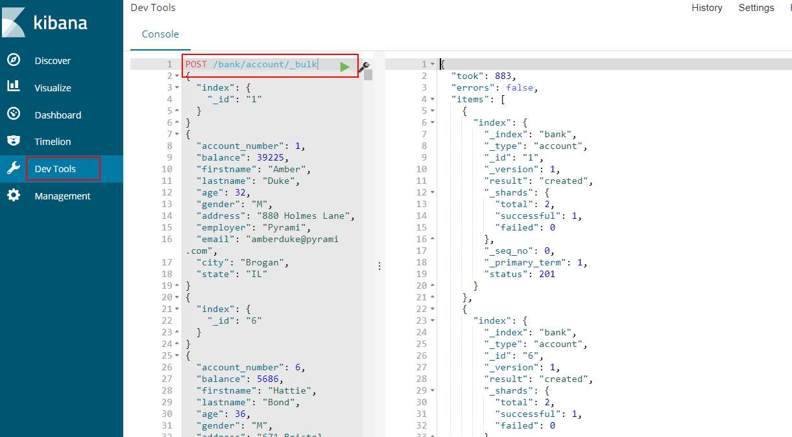

- 导入完成后查看索引信息，可以发现`bank`索引中已经创建了1000条文档。

```bash
GET /_cat/indices?v
```

```bash
health status index    uuid                   pri rep docs.count docs.deleted store.size pri.store.size
yellow open   bank     HFjxDLNLRA-NATPKUQgjBw   5   1       1000            0    474.6kb        474.6kb
```

### 搜索入门

- 最简单的搜索，使用`match_all`来表示，例如搜索全部；

```
GET /bank/_search
{
  "query": { "match_all": {} }
}
```


- 分页搜索，`from`表示偏移量，从0开始，`size`表示每页显示的数量；

```
GET /bank/_search
{
  "query": { "match_all": {} },
  "from": 0,
  "size": 10
}
```

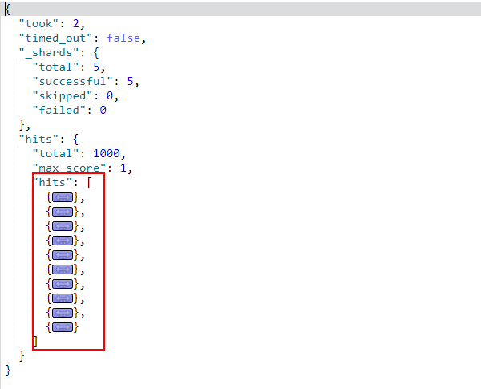

- 搜索排序，使用`sort`表示，例如按`balance`字段降序排列；

```
GET /bank/_search
{
  "query": { "match_all": {} },
  "sort": { "balance": { "order": "desc" } }
}
```

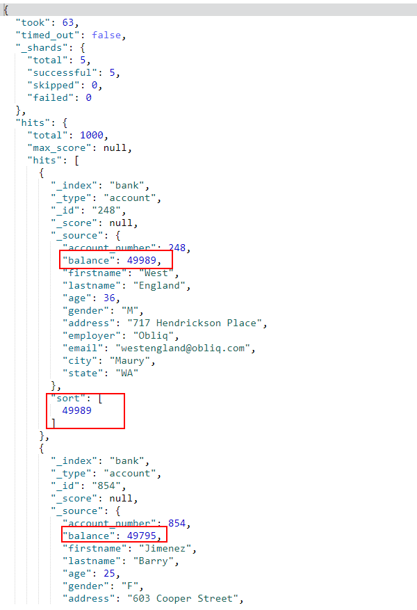

- 搜索并返回指定字段内容，使用`_source`表示，例如只返回`account_number`和`balance`两个字段内容：

```
GET /bank/_search
{
  "query": { "match_all": {} },
  "_source": ["account_number", "balance"]
}
```

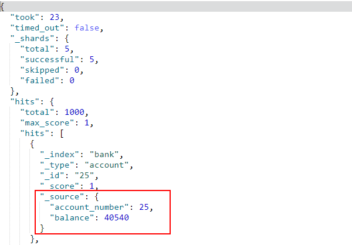

### 条件搜索

- 条件搜索，使用`match`表示匹配条件，例如搜索出`account_number`为`20`的文档：

```
GET /bank/_search
{
  "query": {
    "match": {
      "account_number": 20
    }
  }
}
```

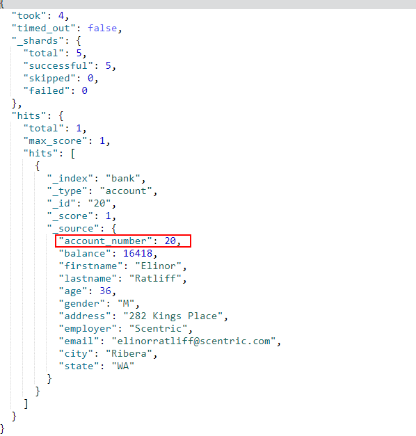

- 文本类型字段的条件搜索，例如搜索`address`字段中包含`mill`的文档，对比上一条搜索可以发现，对于数值类型`match`操作使用的是精确匹配，对于文本类型使用的是模糊匹配；

```
GET /bank/_search
{
  "query": {
    "match": {
      "address": "mill"
    }
  },
  "_source": [
    "address",
    "account_number"
  ]
}
```

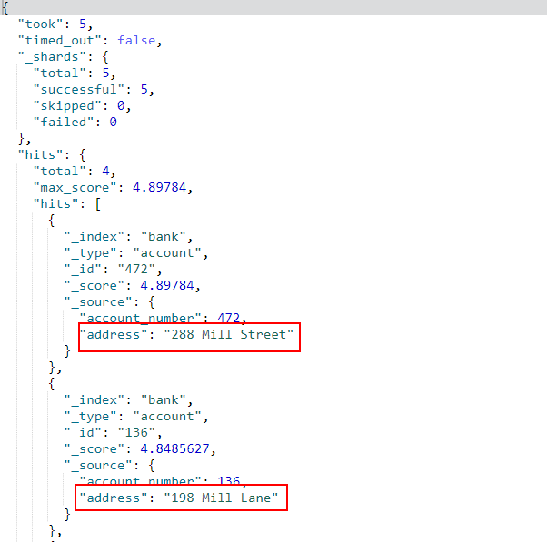

- 短语匹配搜索，使用`match_phrase`表示，例如搜索`address`字段中同时包含`mill`和`lane`的文档：

```
GET /bank/_search
{
  "query": {
    "match_phrase": {
      "address": "mill lane"
    }
  }
}
```


### 组合搜索

- 组合搜索，使用`bool`来进行组合，`must`表示同时满足，例如搜索`address`字段中同时包含`mill`和`lane`的文档；

```
GET /bank/_search
{
  "query": {
    "bool": {
      "must": [
        { "match": { "address": "mill" } },
        { "match": { "address": "lane" } }
      ]
    }
  }
}
```


- 组合搜索，`should`表示满足其中任意一个，搜索`address`字段中包含`mill`或者`lane`的文档；

```
GET /bank/_search
{
  "query": {
    "bool": {
      "should": [
        { "match": { "address": "mill" } },
        { "match": { "address": "lane" } }
      ]
    }
  }
}
```

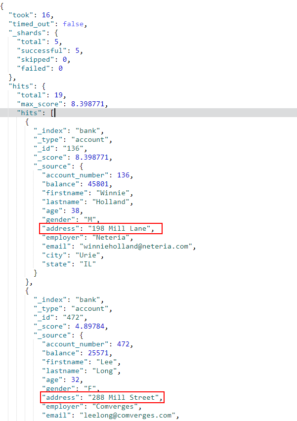

- 组合搜索，`must_not`表示同时不满足，例如搜索`address`字段中不包含`mill`且不包含`lane`的文档；

```
GET /bank/_search
{
  "query": {
    "bool": {
      "must_not": [
        { "match": { "address": "mill" } },
        { "match": { "address": "lane" } }
      ]
    }
  }
}
```

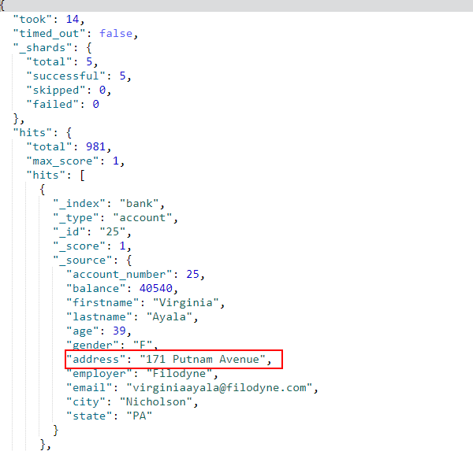

- 组合搜索，组合`must`和`must_not`，例如搜索`age`字段等于`40`且`state`字段不包含`ID`的文档；

```
GET /bank/_search
{
  "query": {
    "bool": {
      "must": [
        { "match": { "age": "40" } }
      ],
      "must_not": [
        { "match": { "state": "ID" } }
      ]
    }
  }
}
```


### 过滤搜索

- 搜索过滤，使用`filter`来表示，例如过滤出`balance`字段在`20000~30000`的文档；

```
GET /bank/_search
{
  "query": {
    "bool": {
      "must": { "match_all": {} },
      "filter": {
        "range": {
          "balance": {
            "gte": 20000,
            "lte": 30000
          }
        }
      }
    }
  }
}
```

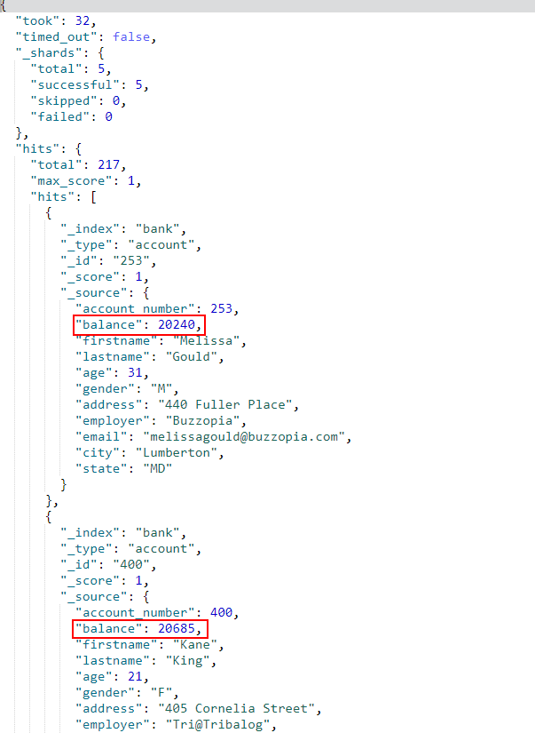

### 搜索聚合

- 对搜索结果进行聚合，使用`aggs`来表示，类似于MySql中的`group by`，例如对`state`字段进行聚合，统计出相同`state`的文档数量；

```
GET /bank/_search
{
  "size": 0,
  "aggs": {
    "group_by_state": {
      "terms": {
        "field": "state.keyword"
      }
    }
  }
}
```

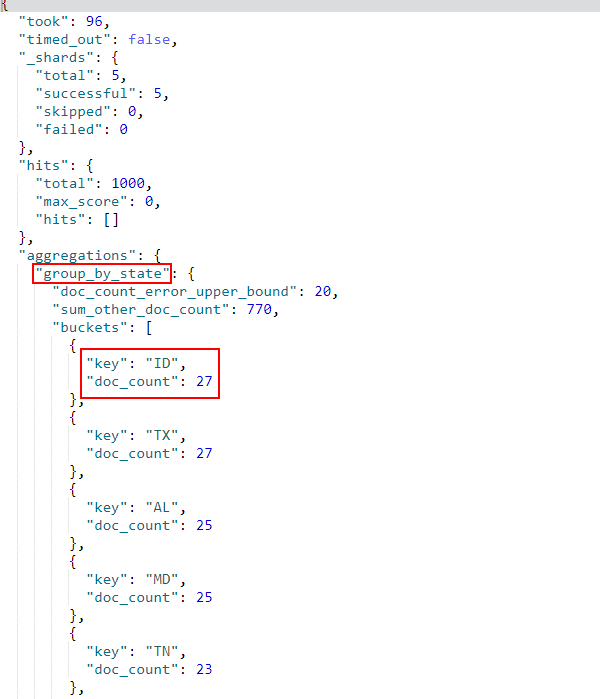

- 嵌套聚合，例如对`state`字段进行聚合，统计出相同`state`的文档数量，再统计出`balance`的平均值；

```
GET /bank/_search
{
  "size": 0,
  "aggs": {
    "group_by_state": {
      "terms": {
        "field": "state.keyword"
      },
      "aggs": {
        "average_balance": {
          "avg": {
            "field": "balance"
          }
        }
      }
    }
  }
}
```

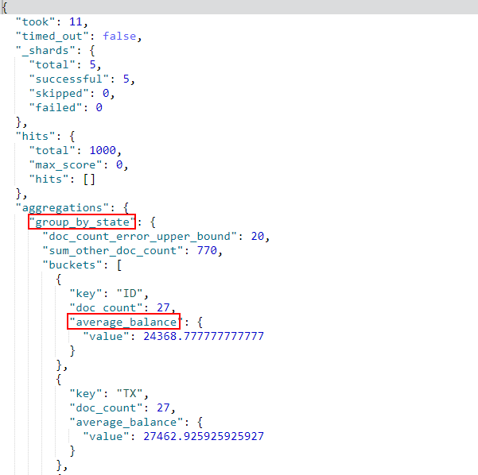

- 对聚合搜索的结果进行排序，例如按`balance`的平均值降序排列；

```
GET /bank/_search
{
  "size": 0,
  "aggs": {
    "group_by_state": {
      "terms": {
        "field": "state.keyword",
        "order": {
          "average_balance": "desc"
        }
      },
      "aggs": {
        "average_balance": {
          "avg": {
            "field": "balance"
          }
        }
      }
    }
  }
}
```

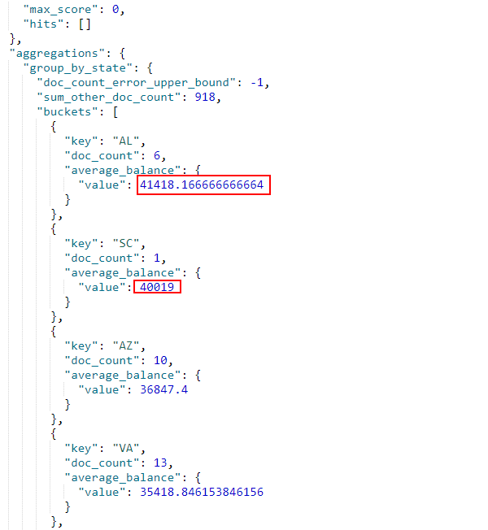

- 按字段值的范围进行分段聚合，例如分段范围为`age`字段的`[20,30]` `[30,40]` `[40,50]`，之后按`gender`统计文档个数和`balance`的平均值；

```
GET /bank/_search
{
  "size": 0,
  "aggs": {
    "group_by_age": {
      "range": {
        "field": "age",
        "ranges": [
          {
            "from": 20,
            "to": 30
          },
          {
            "from": 30,
            "to": 40
          },
          {
            "from": 40,
            "to": 50
          }
        ]
      },
      "aggs": {
        "group_by_gender": {
          "terms": {
            "field": "gender.keyword"
          },
          "aggs": {
            "average_balance": {
              "avg": {
                "field": "balance"
              }
            }
          }
        }
      }
    }
  }
}
```

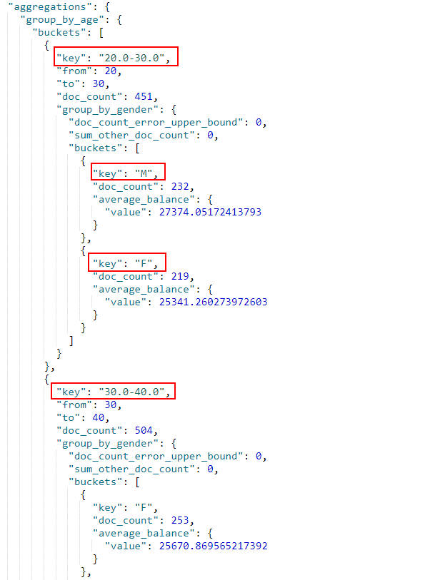

## 参考资料

https://www.elastic.co/guide/en/elasticsearch/reference/6.0/getting-started.html

## 公众号


